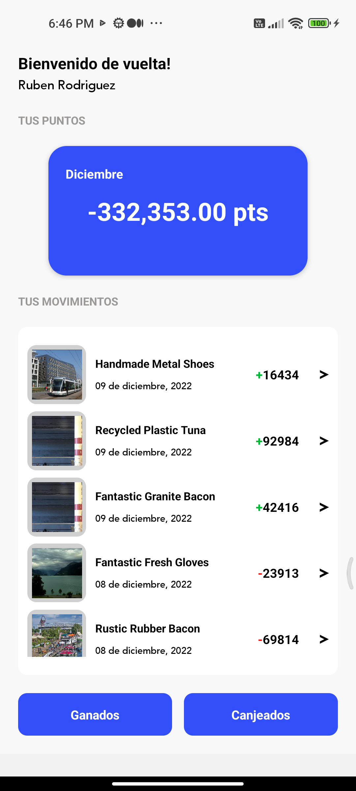
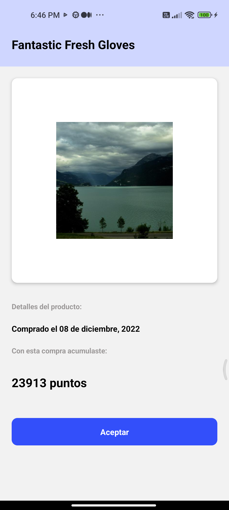
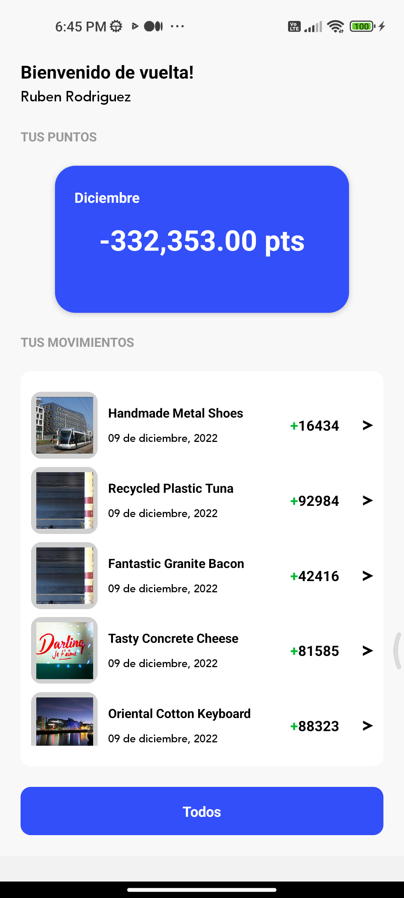
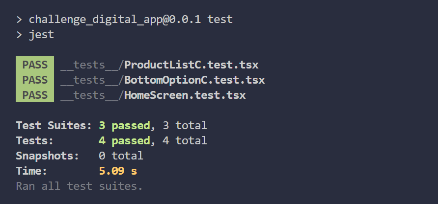

# CHALLENGE_APP

---

Technical challenge of application development developed in Ts and using React-native CLI

## **Installation**

---

```sql
$ git clone https://github.com/MarcoPradoDev/Challenge_Products.git
$ cd Challenge_Products/
$ npm install
$ npx react-native run-android
```

## **Features**

---

- Product List
- Product Detail
- Component Unit Test
- Integration Unit Test

## Screenshots

---

### **Product List - Product Detail**
<br>

</img>
</img>
</img>
<br>

### **Unit Test**
<br>

</img>